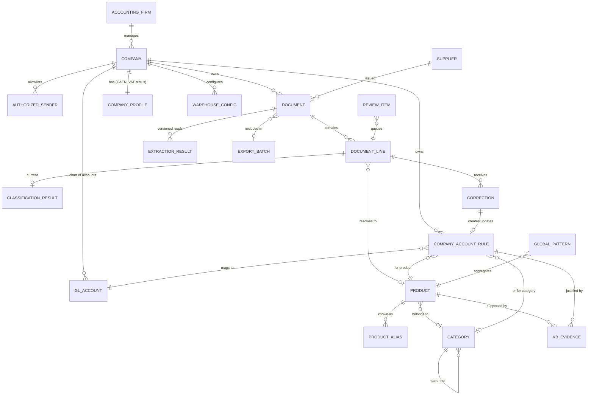
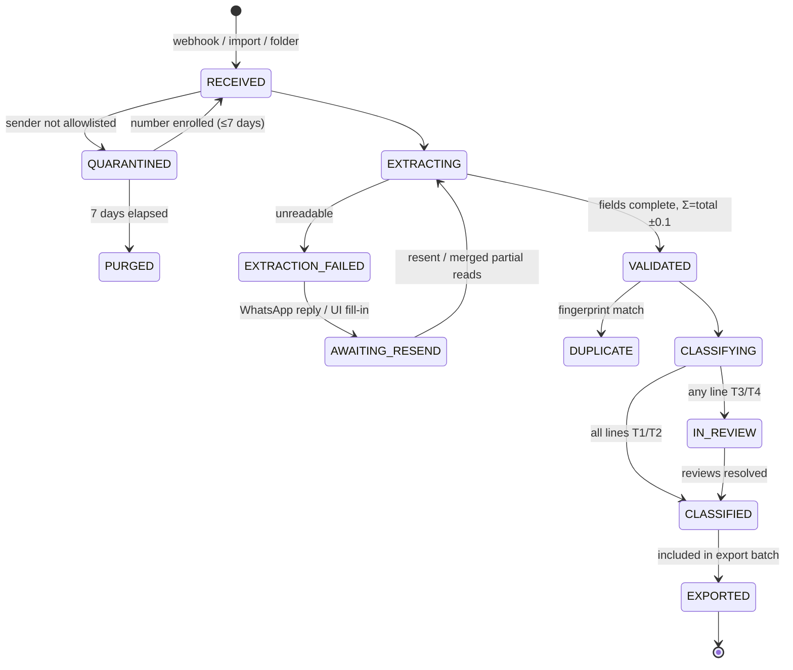

# 04 — Domain Model

Entities, relationships, and invariants for the receipts classification domain. The model is document-type-agnostic by design: a D406 invoice line and a receipt line are both `DocumentLine`s feeding the same knowledge base (ADR-003).

---

## 1. Entity-relationship overview

---

## 2. Entities

### 2.1 Company (tenant)
The accounting firm's client. The unit of knowledge isolation (cross-company consistency 0.695 — rules never leak between companies except via the de-identified global layer, ADR-015).

| Attribute | Notes |
|---|---|
| `company_id` | Internal key |
| `cui` | Romanian fiscal ID (`RO` + digits), unique |
| `name`, `caen_code` | CAEN refreshed monthly via etva/ANAF (client spec) |
| `vat_payer_status`, `active_status` | Refreshed monthly; affects tax-code selection |
| `settings` | Batching mode, auto-apply enablement, confidence threshold overrides |

**Invariant:** every query touching knowledge or documents is scoped by `company_id`.

### 2.2 AuthorizedSender
WhatsApp number allowlisted to submit receipts for a company. Same number may serve multiple companies (client spec). Messages from unknown numbers are quarantined 7 days, then purged.

### 2.3 Supplier
The merchant that issued the receipt. Identified by issuer CUI; name resolved via CUI→registry lookup or receipt text. **Weak classification signal by design (ADR-005)** — used for duplicate fingerprints, alias scoping, and context, never as a mapping key. Petromax (CIF RO90012345, name/CUI anonymized) is a fuel company whose receipt in the worked example is a road vignette, not fuel.

### 2.4 Document
A fiscal source document. `doc_type ∈ {RECEIPT, D406_INVOICE_LINE_SOURCE, MANUAL}`.

| Attribute | Notes |
|---|---|
| `document_id`, `company_id`, `supplier_id` | |
| `doc_type`, `channel` | channel ∈ {WHATSAPP, FRONTEND_IMPORT, FOLDER, D406_SYNC} |
| `receipt_number`, `document_datetime` | From extraction; datetime to the minute when printed |
| `total_amount`, `currency`, `payment_method` | Receipts have amounts (ADR-012) |
| `vat_totals[]` | Per bracket: `{bracket_letter, rate, vat_amount}` — e.g. `{A, 21%, 5.31}` |
| `fingerprint` | (issuer CUI, datetime-to-minute, total) — duplicate detection (ADR-014) |
| `status` | See lifecycle §3 |
| `image_ref` | Object-storage pointer; image never inlined |

### 2.5 ExtractionResult (versioned)
One OCR/structuring pass over a document. Multiple versions exist when a document is resent or merged from partial reads.

| Attribute | Notes |
|---|---|
| `extraction_id`, `document_id`, `version` | |
| `provider`, `provider_model_version` | Which OCR adapter produced it (ADR-011) |
| `fields{}` | Extracted fields, each with its own field-level confidence |
| `extraction_confidence` | Aggregate **extraction** signal — independent of classification (ADR-007) |
| `validation` | Σ lines vs total (±0.1 RON, hard fail > 1 RON), required-field completeness |

### 2.6 DocumentLine
One product line on a document. The unit of classification.

| Attribute | Notes |
|---|---|
| `line_id`, `document_id`, `line_no` | |
| `raw_text` | As printed: `ROVINIETA - A - AUTOTURISME` |
| `normalized_text` | Phase 1 normalization rules: `rovinieta a autoturisme` |
| `quantity`, `unit_of_measure`, `unit_price`, `line_amount` | Present for receipts; null for D406-sourced lines |
| `vat_bracket_letter` | `A` — deterministic per-line VAT link (ADR-010) |
| `vat_percent` | Resolved: 21 |
| `direction` | PURCHASE for receipts (always); D406 lines carry both |
| `product_id` | Resolved canonical product (nullable until matched) |

### 2.7 Product (canonical, global)
A normalized product concept in the shared catalog — **the system's center of gravity** (vision notes, validated: 91.2% of products deterministic). Global entity; company-specific *meaning* lives in `CompanyAccountRule`.

| Attribute | Notes |
|---|---|
| `product_id`, `canonical_text` | e.g. `rovinieta` |
| `display_name` | Generic description (client spec's "normalized name") |
| `category_id` | Semantic category (nullable) |
| `expected_vat[]` | Dated attribute: `{rate, effective_from, effective_to}` — 21% from 2025-08, 19% before (ADR-004). Secondary signal only (94.5% single-rate) |
| `embedding_ref` | Vector for similarity retrieval; model-versioned |
| `global_ads` | Cross-company determinism, recomputed periodically |

### 2.8 ProductAlias
Alternate surface forms mapping to a canonical product: `rovigneta`, `rovinieta conform anexa`, `e-vignette (rovinieta) 12 months a`, supplier-scoped abbreviations. Alias resolution runs before embedding search — it converts fuzzy matches into deterministic ones over time.

### 2.9 Category (global semantic taxonomy)
Semantic grouping (`Taxe drum`, `Carburanți`, `Băuturi calde`) used for cold-start inference and the associated-products heuristic. **Carries no account** (ADR-004): accounts attach per company. Not VAT-partitioned. May be hierarchical.

### 2.10 GLAccount
A company's chart-of-accounts entry, from Phase 1 GL extraction (154,068 records; only 579 accounts actually used in invoice lines — the effective classification space is small). Attributes: `account_id` (e.g. `635`), `description`, `account_type` (Activ/Pasiv — validation layer: purchases land on Activ expense/asset accounts). **Invariant:** classification may only propose accounts existing in the company's chart; the LLM can never invent one.

### 2.11 CompanyAccountRule — the per-company knowledge base entry
The heart of the system. Immutable-versioned mapping.

| Attribute | Notes |
|---|---|
| `rule_id`, `company_id`, `version` | New version per change; old versions retained (audit) |
| `scope` | `PRODUCT` (primary) or `CATEGORY` (fallback) |
| `product_id` / `category_id` | Exactly one, per scope |
| `direction` | PURCHASE / SALE / ANY — same product legitimately differs by direction (Phase 1 finding) |
| `account_id`, `tax_code` | The answer: `635`, `301104` |
| `ads` | Within-company determinism for this mapping |
| `evidence_count`, `last_seen` | Support strength & recency |
| `origin` | `D406_HISTORY` / `CORRECTION` / `MANUAL_MONOGRAPHY` / `COLD_START_GLOBAL` |
| `status` | `ACTIVE` / `SUPERSEDED` / `CONFLICTED` |

**Invariants:**
- At most one ACTIVE rule per (company, product, direction). A correction contradicting an ACTIVE rule marks it CONFLICTED until resolved (repeat-correction detector, 13_OBSERVABILITY).
- Rules are never edited in place — versions supersede (enables audit and lag-free rollback).

### 2.12 KBEvidence
Individual observations supporting rules: `(company_id, product_id, account_id, tax_code, direction, source_doc_type, observed_at)`. D406 sync writes these in bulk (76,843 mappings on day one); confirmed receipt classifications and corrections append. ADS per rule is derived from evidence, so receipts and invoices strengthen each other (ADR-003).

### 2.13 GlobalPattern
De-identified aggregate per (product, direction): account distribution, counts, `global_ads`, company count (ADR-015). For rovinieta/PURCHASE the distribution is split 628 / 635 / 6352 / 471 — `global_ads` low, so the global layer alone can never auto-apply it (this is what makes the worked example land in review for a precedent-less company).

### 2.14 ClassificationResult
The current classification of a line, fully reproducible.

| Attribute | Notes |
|---|---|
| `line_id`, `result_version` | Re-scoring appends versions |
| `account_id`, `tax_code`, `vat_percent`, `warehouse_id` | The four outputs |
| `tier` | 1–4 (08_CONFIDENCE_CASCADE) |
| `method` | COMPANY_RULE / GLOBAL_RULE / ALIAS / EMBEDDING / LLM / MANUAL |
| `classification_confidence` | Independent of extraction confidence (ADR-007) |
| `evidence` | rule_id+version, similarity scores, candidates considered |
| `versions{}` | threshold-config version, embedding model, LLM model+prompt version (ADR-016) |
| `stale` | Set by rule-change impact worker (06) — never for exported docs |

### 2.15 Correction
An accountant's override: who, when, line, `(from → to)` for any of the four outputs, reason code. Emits `correction.submitted`; the Knowledge Lifecycle turns it into a rule version. Corrections are the Tier 4→Tier 1 conveyor belt.

### 2.16 ReviewItem
Queue entry for Tier 3 lines and Tier 2 spot-checks; carries both confidences, candidates with evidence, and SLA timestamps.

### 2.17 WarehouseConfig
Per-company deterministic warehouse assignment (ADR-009): `default_warehouse_id` + optional overrides by doc type/account class. Not learned — warehouse_id is 100% absent from D406 history.

### 2.18 ExportBatch
Generated XML for the accounting system, per client selection. Documents in an export become immutable (`status = EXPORTED`); rule changes never touch them (ADR-008).

---

## 3. Document lifecycle

---

## 4. Domain invariants (consolidated)

1. **Tenant scoping** — no knowledge read/write without `company_id`, except the de-identified global layer.
2. **Two confidences** — extraction and classification confidence never combine into one number anywhere in the model, API, or UI (ADR-007).
3. **Account existence** — proposed `account_id` must exist in the company's GL chart.
4. **Immutability after export** — exported documents and their classifications are frozen; corrections after export create adjusting entries in the target system, out of scope here (OPEN-Q10).
5. **Versioned everything** — rules, extraction results, classification results, thresholds: append-only versions.
6. **Warehouse is config** — no learning path may write warehouse mappings (ADR-009).
7. **Direction-aware rules** — receipts are always PURCHASE; D406-sourced evidence carries its own direction and never contaminates the other direction's rules.

---

## 5. Worked example anchored in the model

Petromax receipt (name/CUI anonymized) → `Document{doc_type: RECEIPT, channel: WHATSAPP, supplier: RO90012345, total: 30.57, vat_totals: [{A, 21%, 5.31}], fingerprint: (RO90012345, 2026-03-16T13:32, 30.57)}` → one `DocumentLine{raw: "ROVINIETA - A - AUTOTURISME", normalized: "rovinieta a autoturisme", vat_bracket_letter: A, vat_percent: 21, direction: PURCHASE}` → alias resolution → `Product{canonical: "rovinieta"}` → `CompanyAccountRule{company: <client>, product: rovinieta, direction: PURCHASE, account: 635, tax_code: 301104, ads: 1.0, evidence: 55, origin: D406_HISTORY}` (if the client company has Nordline-like history) → `ClassificationResult{tier: 1, account 635, tax_code 301104, vat 21, warehouse: <config default>}`. Full trace with the no-precedent branch: 11_SEQUENCE_PETROMAX.md.
