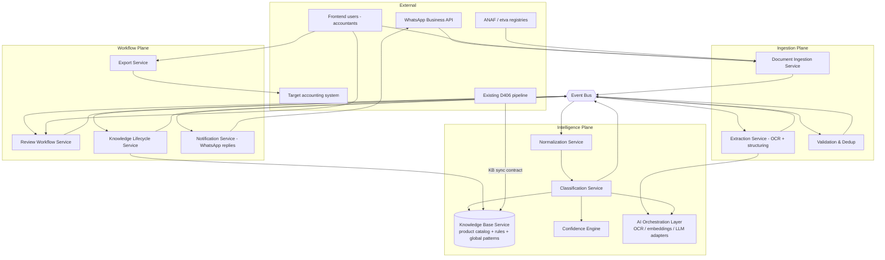

# 05 — Service Architecture

Service boundaries are drawn around **data ownership and rate of change**, not deployment units. Whether these run as separate deployables or modules in a monolith is a deployment decision pending stack confirmation (OPEN-Q1); the *contracts* below are binding either way.

---

## 1. Context diagram

---

## 2. Services

### 2.1 Document Ingestion Service
**Owns:** `Document` (pre-extraction), `AuthorizedSender`, quarantine store, receipt images (object storage refs).
**Does:** WhatsApp webhook (signature-verified), frontend/folder import, allowlist enforcement, 7-day quarantine for unknown senders, image storage, `document.received` emission. Monthly etva/ANAF refresh of company profiles (CAEN, VAT status) also lives here — it is registry I/O, not intelligence.
**Hard rule:** intake is durable-first — persist the raw message + image *before* any processing, so downstream outages never lose documents (NFR availability).
**Doesn't:** read the receipt, know anything about accounts.

### 2.2 Extraction Service
**Owns:** `ExtractionResult` versions.
**Does:** invokes OCR via the AI Orchestration Layer (provider-agnostic, ADR-011); structures raw OCR into the document field schema (supplier, CUIs, totals, VAT brackets incl. per-line letters — ADR-010, lines, payment method, datetime, receipt number); computes field-level and aggregate **extraction confidence** (ADR-007); emits `document.extracted` or `document.extraction_failed`.
**Doesn't:** validate business rules, classify, talk to WhatsApp (failure replies are Notification's job, triggered by events).

### 2.3 Validation & Dedup
**Owns:** fingerprint index, validation verdicts.
**Does:** required-field completeness; arithmetic reconciliation Σ lines = total ±0.1 RON (hard fail > 1 RON); duplicate fingerprint matching and partial-read joining (ADR-014); emits `document.validated` / `document.validation_failed` / `document.duplicate_detected`.

### 2.4 Normalization Service
**Owns:** normalization rulebook (the Phase 1 rules, promoted to a shared library/service so D406 and receipts normalize identically — a drift point if duplicated).
**Does:** raw line text → normalized text (lowercase, diacritics, noise stripping); deterministic alias lookup → canonical `product_id` when known.
**Note:** LLM-based "give this a generic name" (client spec) happens only for new products at Tier 3/4, via AI Orchestration — normalization itself stays deterministic and cheap.

### 2.5 Knowledge Base Service — the center of gravity
**Owns:** `Product`, `ProductAlias`, `Category`, `CompanyAccountRule` (+versions), `KBEvidence`, `GlobalPattern`, embeddings index, `GLAccount` mirror, `WarehouseConfig`.
**Serves:** point lookups (company rule by product+direction — <10ms), similarity retrieval (top-K by embedding, company-scoped then global — <50ms), rule administration (monography), evidence append.
**Consumes:** `knowledge.*` commands from Knowledge Lifecycle only — **no other service writes rules.**
**D406 Sync contract (ADR-003):** the existing D406 pipeline feeds the KB through one idempotent bulk contract: `PUT /kb/companies/{cui}/evidence:batch` with (normalized_product, account_id, tax_code, direction, count, first_seen, last_seen). Day-one seeding = Phase 1's 76,843 mappings. How the D406 pipeline is deployed/scheduled today is OPEN-Q2.

### 2.6 Classification Service
**Owns:** `ClassificationResult` versions. Stateless over KB data.
**Does:** executes the locked RULES_FIRST order (deterministic lookup → embedding fallback → VAT re-rank), calls Confidence Engine for tiering, resolves VAT% (bracket letter → arithmetic → KB expectation → LLM), resolves WarehouseID from `WarehouseConfig`, validates account existence + Activ/Pasiv plausibility against the GL chart.
**Two invocation modes, one engine (ADR-013):** sync API (<100ms p95; no LLM in path — would-be Tier 3 returns `PENDING`) and async worker (LLM batching allowed).

### 2.7 Confidence Engine
**Owns:** threshold configuration (versioned, ADR-016), tiering logic.
**Does:** takes match evidence (rule ADS, evidence count, recency, similarity scores, candidate agreement, VAT corroboration) → assigns tier + classification confidence. Consumes extraction confidence only as a *gate* (bad extraction → repair loop, not review queue) — never blends it (ADR-007). Full spec: 08.

### 2.8 Review Workflow Service
**Owns:** `ReviewItem` queue, reviewer assignment, SLA state.
**Does:** materializes Tier 3/4 items and Tier 2 spot-check samples; serves the frontend review UI (candidates + evidence + both confidences); accepts decisions; emits `correction.submitted` / `classification.confirmed`. Suppresses duplicates and unauthorized-source docs from the queue (client spec).

### 2.9 Knowledge Lifecycle Service (feedback loop)
**Owns:** the correction→rule pipeline; conflict state.
**Does:** consumes `correction.submitted` and `classification.confirmed`; appends evidence; creates/supersedes rule versions; detects conflicts (correction vs ACTIVE rule → `CONFLICTED`, surfaces to monography); recomputes per-rule ADS; schedules embedding upserts for new products; emits `knowledge.rule_changed`. Also runs the **impact worker**: on rule change, marks affected *unexported* documents stale for lazy re-scoring — never synchronous mass reprocessing (ADR-008, design in 06).

### 2.10 Export Service
**Owns:** `ExportBatch`, generated XML artifacts.
**Does:** per client selection, generates accounting-system XML from CLASSIFIED documents; freezes them (`EXPORTED`); target schema is OPEN-Q10.

### 2.11 Notification Service
**Owns:** message templates (Romanian), send log.
**Does:** WhatsApp confirmations, resend requests (supplier+value+date per client spec), rejection template for unknown numbers. Consumes events only.

### 2.12 AI Orchestration Layer
Cross-cutting adapter layer for OCR, embeddings, LLM (ADR-011). Owns provider adapters, routing config, budgets/kill switch, prompt registry. Full spec: 09. **No service may import a vendor SDK outside this layer.**

---

## 3. Boundary rules

1. **Single-writer:** each datum has exactly one writing service (rules → Knowledge Lifecycle; results → Classification; documents → Ingestion/Extraction pipeline stages).
2. **Events between planes, calls within a request path:** cross-plane integration is event-driven (durable, replayable); the sync classify path may call KB + Confidence in-process/RPC to meet <100ms.
3. **Tenant scoping at every boundary:** `company_id` is mandatory on every contract; the only unscoped reads are `GlobalPattern` (de-identified, ADR-015).
4. **Provenance on every write:** doc_type + channel + versions travel with all evidence and results.
5. **The D406 pipeline is a peer feeder, not a fork:** it uses the same evidence contract as the receipts pipeline. If the invoice flow later wants live classification, it calls the same sync API (ADR-013) — shared intelligence is structural, not aspirational.

---

## 4. Technology candidates (pending confirmation — OPEN-Q1/3/4)

| Concern | Candidates | Tradeoff sketch |
|---|---|---|
| Relational store (documents, rules, evidence) | PostgreSQL; MySQL; SQL Server | Postgres favored if pgvector consolidates vector + relational; final call = whatever ADS-Cascade already runs |
| Vector index | pgvector (in-DB); Qdrant; OpenSearch k-NN | pgvector: one store, simpler ops, fine at 47K–1M products; dedicated engine only if scale/latency demands |
| Event backbone | Managed queue/stream (SQS+SNS, Pub/Sub); Kafka/Redpanda; RabbitMQ | Modest volumes → managed queue simplest; Kafka only if ADS-Cascade already operates it |
| Object storage (images) | S3; GCS; Azure Blob | Client spec's Textract affinity hints AWS, but unconfirmed |
| OCR / LLM / embeddings | See 09 | Behind adapters regardless |
