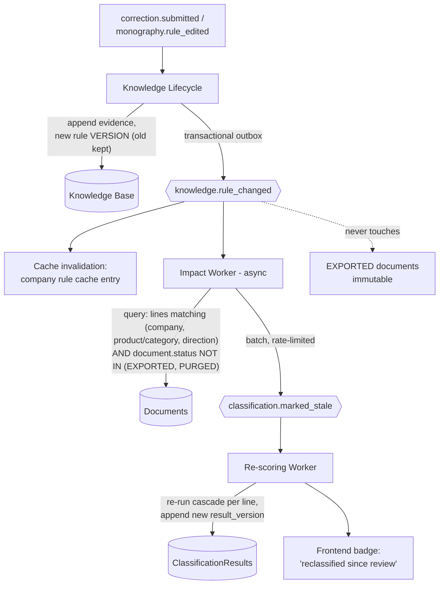

# 06 — Event-Driven Workflow

Defines the event catalog, delivery semantics, and — the critical design — how a category/rule correction propagates **without synchronous mass reprocessing** (ADR-008; deliberate divergence from the client spec's "all documents would be reprocessed with that change").

---

## 1. Event catalog

All events share an envelope: `{event_id, event_type, event_version, occurred_at, company_id, correlation_id, causation_id, payload}`. `correlation_id` = document trace ID from WhatsApp message ID through export (13_OBSERVABILITY). Payloads carry IDs + minimal facts, never receipt images, phone numbers, or secrets.

| Event | Producer | Key payload | Consumers |
|---|---|---|---|
| `document.received` | Ingestion | document_id, channel, image_ref | Extraction |
| `document.quarantined` | Ingestion | sender hash, expiry | Notification |
| `document.extracted` | Extraction | document_id, extraction_id, extraction_confidence | Validation |
| `document.extraction_failed` | Extraction | document_id, failure reasons | Notification (resend request), Frontend |
| `document.validated` | Validation | document_id, line count, fingerprint | Classification worker |
| `document.validation_failed` | Validation | document_id, failed checks | Notification, Frontend |
| `document.duplicate_detected` | Validation | document_id, matched_document_id, merge/suppress | Frontend (suppression) |
| `line.classified` | Classification | line_id, result_version, tier, method, confidence | Review (T2 sample/T3/T4), Metrics |
| `document.classification_completed` | Classification | document_id, tier histogram | Notification (WhatsApp confirmation), Frontend |
| `review.item_created` | Review | review_item_id, line_id, tier | Frontend, SLA monitor |
| `classification.confirmed` | Review | line_id, result_version, reviewer | Knowledge Lifecycle |
| `correction.submitted` | Review / Frontend edit | line_id, field deltas (from→to), reviewer, reason | Knowledge Lifecycle |
| `monography.rule_edited` | Frontend (monography) | company_id, scope, product/category, new mapping, mode (recommended/historic/new) | Knowledge Lifecycle |
| `knowledge.evidence_appended` | Knowledge Lifecycle | company_id, product_id, source | Metrics |
| `knowledge.rule_changed` | Knowledge Lifecycle | company_id, rule_id, old_version, new_version, scope | **Impact worker**, Metrics, Cache invalidation |
| `knowledge.rule_conflicted` | Knowledge Lifecycle | rule_id, conflicting corrections | Frontend (monography attention) |
| `knowledge.product_created` | Knowledge Lifecycle | product_id, canonical_text | Embedding upsert worker |
| `classification.marked_stale` | Impact worker | line_ids (batched), cause rule_id/version | Re-scoring worker |
| `export.batch_generated` | Export | batch_id, document_ids | Frontend; freezes documents |

**Delivery semantics:** at-least-once with idempotent consumers (dedup on `event_id`). Producers write state + event in one transaction via a transactional outbox — no dual-write races. Per-`company_id` ordering where the consumer needs it (rule changes); global ordering not required. Dead-letter queues with alerting on depth (13).

---

## 2. Correction propagation — the design that replaces mass reprocessing

### 2.1 The problem with the client spec's approach

"User changes monography → all documents reprocessed with that change" is synchronous O(history) work on every edit. At Phase 1 scale (296,648 lines and growing), one edit to a common category triggers six-figure reclassification; two concurrent edits race; and reclassifying *booked* fiscal documents silently rewrites audit history. This pattern is prohibited.

### 2.2 The replacement: versioned rules + scoped, lazy, forward-biased propagation

**Rules of propagation:**

1. **Forward-first.** The new rule version takes effect immediately for all *future* classifications (cache entry for that (company, product, direction) invalidated on `knowledge.rule_changed`; next lookup reads the new version). Cost: one cache invalidation. This is the only synchronous effect of an edit.
2. **Scoped backward re-scoring, async.** The impact worker selects only lines that (a) belong to the same company, (b) matched the changed rule's product/category + direction, and (c) live in documents not yet EXPORTED. Typical impact set: tens of lines, not the corpus. Re-scoring appends a new `ClassificationResult` version — nothing is edited in place.
3. **Rate-limited and batched.** Impact batches (e.g. 500 lines) with a per-company concurrency cap so a monography overhaul during month-end close cannot starve live classification. Backlog depth is a monitored metric.
4. **Exported documents are immutable.** A rule change after export produces no mutation; if the accountant needs the booked entry fixed, that is an adjusting entry in the target accounting system (out of scope, OPEN-Q10). The monography UI states this explicitly.
5. **Lazy completion.** If a stale-marked line is opened in the UI before the re-scoring worker reaches it, the read path re-scores it on demand (<100ms, it's a rules/embedding pass — ADR-013 sync engine). Staleness is therefore a UX hint, never an correctness gap.
6. **Convergence guarantee.** Re-scoring always reads the *current* ACTIVE rule version; if a second edit lands mid-propagation, later re-scores use the newer version and earlier ones are re-marked by the second event. Last-writer-wins at the rule level is safe because rule versions are totally ordered per (company, product, direction).

### 2.3 Why this satisfies the learning-loop requirement

Correction → active rule latency is one event hop (target: seconds–minutes, NFR). The accountant sees: correct one rovinieta line today → tomorrow's rovinieta receipt auto-applies at Tier 1 with `origin: CORRECTION`, `evidence_count: 1→2→3` climbing until ADS-based confidence fully stabilizes (thresholds in 08).

---

## 3. Pipeline choreography (happy path)

`document.received` → `document.extracted` → `document.validated` → `line.classified`×N → `document.classification_completed` → (T3 lines: `review.item_created` → `classification.confirmed`/`correction.submitted` → `knowledge.*`) → `export.batch_generated`.

Each stage is an independent consumer: a downed Extraction service delays but never loses documents (durable intake, 05 §2.1). Retry with exponential backoff; poison messages → DLQ + alert.

---

## 4. Batching windows

LLM-dependent steps (Tier 3 categorization, VAT assumption) run on a batch trigger: size N or T-minute timer, whichever first (client spec proposed 15 min for cost; made configurable per NFR latency/cost trade — pending business confirmation, OPEN-Q6). Batching applies **only** to the async pipeline; the sync classify API never waits on a batch (ADR-013).

---

## 5. Schema evolution

Events carry `event_version`; consumers tolerate unknown fields (additive evolution); breaking changes require a new event type. The event catalog above is v1.
