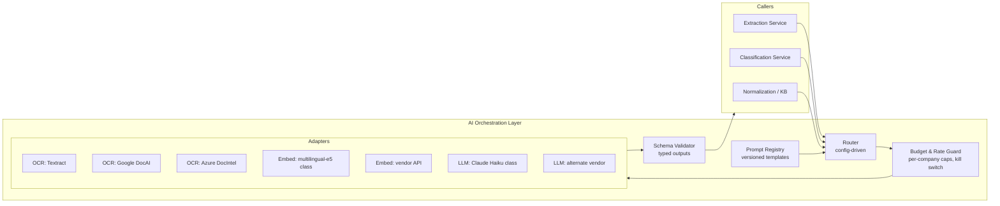

# 09 — AI/LLM Orchestration Layer (Model-Agnostic)

All machine intelligence — OCR, embeddings, LLM reasoning — sits behind provider-agnostic interfaces (ADR-011). The client spec's Textract + Haiku are **first candidates, not commitments**; no service imports a vendor SDK outside this layer's adapters. This is cheap insurance, not over-engineering: the LLM serves only the Tier 3 tail (~5–9% of lines), so swapping vendors is a routing-config change, and the production stack is unconfirmed (OPEN-Q1).

---

## 1. Structure



Components: **Router** (capability → adapter, per-environment config, canary weights); **Budget Guard** (per-company daily LLM caps, global spend alarm, deterministic-only kill switch — 13/14); **Prompt Registry** (versioned templates; prompt version stamped on every `classification_result.config_versions`, ADR-016); **Schema Validator** (all LLM output parsed against typed schemas; malformed → one retry → route to Tier 3 review as "LLM unavailable" — never a free-text passthrough).

---

## 2. Capability interfaces (contracts, not code)

### 2.1 `DocumentExtraction`

```yaml
extract_receipt:
  input:  { image_ref, language_hint: "ro", document_kind: "FISCAL_RECEIPT" }
  output:
    fields:
      supplier_name: {value, confidence}
      issuer_cui:    {value, confidence}        # 'RO' + digits
      receiver_cui:  {value, confidence} | null
      receipt_number: {value, confidence}
      datetime:      {value, confidence, granularity: MINUTE|DAY|MONTH}
      total:         {value, confidence}
      payment_method: {value, confidence}       # NUMERAR|CARD|...
      vat_totals:    [{bracket_letter, rate, amount, confidence}]
      lines:         [{raw_text, quantity, unit, unit_price, amount,
                       vat_bracket_letter, confidence}]   # ADR-010
    raw_text: string                             # full OCR text, retained for audit/repair
    provider: {adapter_id, model_version}
```

Requirements on any adapter: per-field confidence (ADR-007), Romanian language + diacritics, thermal-paper tolerance, per-line VAT bracket letters when printed. Candidates: **AWS Textract** (client affinity; AnalyzeExpense has receipt priors, weaker RO field labels), **Google Document AI** (strong receipt parser, EU region available), **Azure Document Intelligence** (prebuilt receipt model, RO support listed). Selection = pilot bake-off on real Romanian receipts (OPEN-Q13); the sample Petromax image (name anonymized) is test case #1.

### 2.2 `TextEmbedding`

```yaml
embed: { input: [normalized_text], model_id, output: [vector] }
```

Requirements: Romanian/multilingual (Phase 1 known limitation: all product text is Romanian); stable model versioning — **an embedding model change is a KB migration event**: dual-write new vectors, backfill 47,306+ products, atomically switch the index, keep the old index until verified (embedding rows are keyed by `model_id`, 07 §2). Candidates: multilingual-e5 family (self-hosted, no per-call cost, needs infra), vendor embedding APIs (Cohere embed-multilingual, OpenAI/Voyage class — zero infra, per-call cost, subprocessor terms per 12).

### 2.3 `StructuredReasoning` (LLM)

Three tasks only — the LLM is a tail worker, never the primary classifier (91.2% deterministic; ADR-002):

```yaml
categorize_product:            # Tier 3/4 support + new-product intake
  input:
    line: {normalized_text, raw_text, vat_percent?, unit?, unit_price?}
    company_context:
      candidate_accounts: [{account_id, description, account_type}]   # closed list — company chart only
      category_candidates: [{category_id, name}]
      similar_products: [{text, account_id, similarity}]              # retrieval-grounded
  output:
    proposal: {account_id ∈ candidate_accounts, category_id | new_category_name,
               display_name, rationale, self_confidence}
  constraints: output schema-validated; account_id outside the closed list = hard reject (12 §LLM risks)

assume_vat:                    # client spec's N-products-2-rates residual case ONLY
  input:  { lines_without_bracket: [...], available_rates: [21, 11], receipt_vat_totals }
  output: { per-line rate assignment + self_confidence }              # arithmetic must reconcile or → review

suggest_alias:                 # normalization support for cryptic receipt abbreviations
  input:  { raw_text, supplier_name, candidate_products: top-K }
  output: { matched product_id | none, self_confidence }
```

Prompt-injection posture: receipt text is **data, never instructions** — delimited and declared untrusted in the template; no tool use; no side effects; output only via schema (12). Candidates: **Claude Haiku class** (client proposal — right cost/latency class, batch API + prompt caching fit the 15-min batch mode), or an equivalent small model from another vendor; the Router makes this a config choice. LLM `self_confidence` is advisory display metadata only — **tiering uses evidence-based confidence, and LLM output always lands in Tier 3 review regardless** (08 §Tier 3).

---

## 3. Invocation rules

| Rule | Detail |
|---|---|
| Sync path: zero LLM | The <100ms classify API never awaits an LLM (ADR-013). Would-be Tier 3 → `PENDING_REVIEW`/`PENDING_LLM`, LLM proposal arrives via event |
| Batching | Tier 3 LLM work batches (size N or T minutes — client spec's 15-min mode; configurable per 06 §4) with prompt caching for the shared company-context prefix |
| Budgets | Per-company daily token caps; breach → queue to review without LLM proposal + alert (14 guardrails) |
| Degradation ladder | LLM down → Tier 3 items queue for human review unassisted. Embeddings down → deterministic-only mode (T1 + T4). OCR down → documents wait durably in intake (05 §2.1). Each stage fails toward *human work*, never toward *wrong answers* |
| Version stamping | adapter_id, model version, prompt version on every result (ADR-016) — reproducibility and drift forensics |
| Canarying | Router supports weighted split (e.g. 95/5) for adapter migration with per-adapter quality metrics (13) |

---

## 4. What this layer is not

Not a "reasoning engine" in the classification hot path. The Product Catalog + rules are the center of gravity (vision notes, validated by 91.2% determinism); this layer is the pluggable periphery that reads paper, embeds text, and drafts proposals for the ambiguous tail. If every LLM vendor disappeared tomorrow, Tier 1/2 classification — ~90%+ of volume — would be unaffected.
