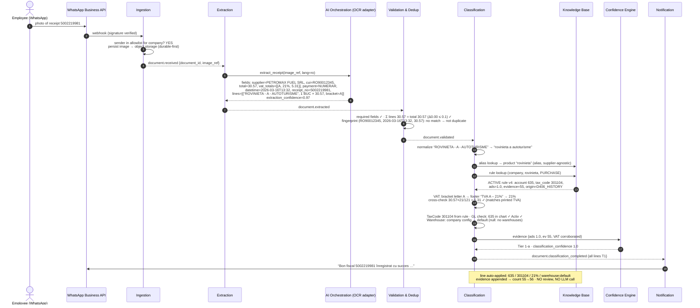
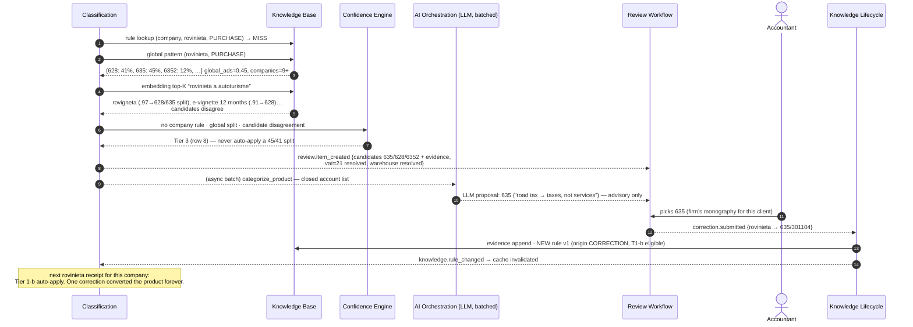

# 11 — End-to-End Trace: The Petromax Rovinieta Receipt

The running worked example, traced through every component. This receipt was chosen deliberately: **a fuel company selling a non-fuel item** (supplier-signal trap, ADR-005) whose product is **cross-company divergent in the real Phase 1 data** (628 vs 635 vs 6352 — the hybrid-KB case, ADR-001).

> Vendor/company names, CUIs, and the address below are fictionalized for public documentation. The account codes, evidence counts, and statistical shape (which accounts a shared product diverges to, and how consistently) reproduce the real Phase 1 finding.

## 1. The physical receipt (source: client-provided sample, anonymized)

| Field on paper | Value |
|---|---|
| Merchant | PETROMAX FUEL SRL, Jud. Argeș, Com. Exemplu |
| Issuer CUI | RO90012345 |
| Line 1 | `ROVINIETA - A - AUTOTURISME` — 1 BUC × 30.57 = **30.57 A** |
| SUBTOTAL / TOTAL LEI | 30.57 |
| Payment | NUMERAR (cash) 30.57, REST 0.00 |
| VAT footer | TOTAL TVA **A – 21%** = 5.31; TOTAL TVA BON 5.31 |
| Line count | NR. POZ. ART. IN BON: 1 |
| Timestamp | 16-03-2026 13:32:38 |
| Receipt no. | BON FISCAL 5002219981 |

Ground-truth answers this trace must produce: **AccountID** per company monography (635 or 628 — evidenced below), **VAT% 21**, **TaxCode 301104** (standard-rate purchase, 110,430 Phase 1 lines), **WarehouseID** from company config.

## 2. Phase 1 evidence for this exact product

From `product_account_mapping.csv` (real data, company names anonymized):

| Company | Product text | Account | Count |
|---|---|---|---|
| NORDLINE TRANS SRL | ROVINIETA | **635** CHELT. CU ALTE IMPOZITE, TAXE | 55 |
| AGROVIN SUD SRL | ROVIGNETA / ROVINIETA CONFORM ANEXA / … | **628** ALTE CHELT. CU SERVICIILE EXECUTATE DE TERTI | 17 |
| VERDEFERM SRL | ROVINIETA | **628** | 6 |
| BRIGHT VENDING SOLUTIONS SRL | ROVIGNETA AUTOTURISME_12 LUNI_TIP A | **6352** IMPOZITE, TAXE DIVERSE | 18 |
| CORELINE AXF SRL | ROVIGNETA | **471** CHELT. INREGISTRATE IN AVANS | 2 |
| METRICA VALEA BAND SRL | ROVINIETA | **6022** CHELT. PRIVIND COMBUSTIBILUL | 1 |

Within each company: deterministic (Nordline ads = 1.0 over 55 observations). Across companies: split — global_ads ≈ 0.45. That last row (6022 = fuel expense) is a real misbooking that matches the supplier prior "Petromax ⇒ fuel"; product text dominance avoids reproducing it.

## 3. Sequence — company WITH precedent (steady state, Tier 1)

Assume the client company's D406 history books rovinieta → 635 (Nordline-like).

**Resolved output:**

| Field | Value | Why |
|---|---|---|
| AccountID | **635** | Company rule, ads 1.0, 55 observations from D406 history (Tier 1-a) |
| VAT% | **21** | Per-line bracket letter A ↔ footer `TVA A – 21%` (ADR-010); arithmetic check 30.57 × 21/121 = 5.31 ✓ |
| TaxCode | **301104** | Carried on the company rule; the standard-rate purchase code (110,430 Phase 1 lines) |
| WarehouseID | **null (config default)** | ADR-009 — configuration, not learned; D406 has zero warehouse data |

Latency: rules + cache path, no LLM — well inside the <100ms classification budget (OCR happens upstream, asynchronously).

## 4. Sequence — company WITHOUT precedent (cold start, Tier 3 → learning loop)

Note what did **not** happen: the supplier ("Petromax") never drove the account (a supplier prior proposes 6022 Fuel — the real misbooking in row 6 of §2); VAT never picked the account (21% is compatible with 628, 635 and 6352 alike — secondary signal, R4); and the LLM proposal did not auto-apply (08 §Tier 3).

## 5. Correction propagation for this product (ADR-008)

If the accountant later flips the monography 635 → 628: new rule version → `knowledge.rule_changed` → impact worker marks *only* this company's unexported rovinieta lines stale (a handful) → lazy re-score. The 55 exported/booked historical lines are untouched. No mass reprocessing.

## 6. Edge-case behavior on this same receipt

| Variation | Path |
|---|---|
| Blurry photo, total unreadable | Extraction gate fails → duplicate-join attempt → WhatsApp resend request (“PETROMAX…, 30.57, 16-03-2026 — vă rugăm retrimiteți”); never reaches classification review (ADR-007) |
| Same receipt sent twice | Fingerprint (RO90012345, 13:32, 30.57) matches → merged/suppressed, not double-booked (ADR-014) |
| Employee also buys a coffee on the receipt (line 2, bracket B 11%) | Bracket letters resolve each line’s VAT deterministically; coffee classifies independently (likely different account — the spec’s associated-products case) |
| Receipt from before Aug 2025 with 19% | Historical rate accepted for that document date; rate-transition table maps expectation (19→21) so old evidence still corroborates (08 §5) |
