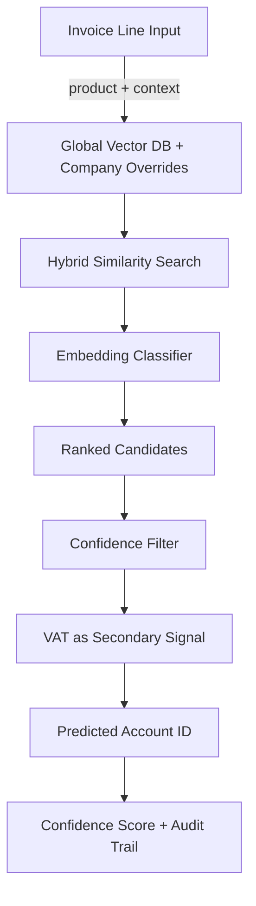

# D406 Invoice Classification — Architecture Decision Report

Generated: 2026-08-11 05:21 UTC
Dataset: 60 companies, 2622 invoices, 7523 lines, ? unique products

---

## Executive Summary

The D406 dataset exhibits a **weighted ADS of 0.9031** (unweighted: 0.9597) with a cross-company consistency score of 0.7632. Based on evidence-driven threshold analysis, the recommended retrieval strategy is **HYBRID** with **HIGH** confidence. The model complexity recommendation is **EMBEDDING_PRIMARY**, and VAT should be used as a **SECONDARY_FEATURE** signal.

---

## 1. Accounting Determinism Score

- **Dataset ADS (weighted):** 0.9031
- **Dataset ADS (unweighted):** 0.9597
- **Cross-company consistency:** 0.7632

**Interpretation:** The dataset shows high consistency — most products map to a single dominant account with high confidence.

### Per-Company ADS Distribution

**Top 5 most consistent:**
  - SYNTH COMPANY 004 SRL: 100.0% consistent, avg determinism 1.0
  - SYNTH COMPANY 006 SRL: 100.0% consistent, avg determinism 1.0
  - SYNTH COMPANY 007 SRL: 100.0% consistent, avg determinism 1.0
  - SYNTH COMPANY 009 SRL: 100.0% consistent, avg determinism 1.0
  - SYNTH COMPANY 015 SRL: 100.0% consistent, avg determinism 1.0

**Top 5 least consistent:**
  - SYNTH COMPANY 030 SRL: 90.91% consistent, avg determinism 0.8312
  - SYNTH COMPANY 055 SRL: 90.91% consistent, avg determinism 0.8909
  - SYNTH COMPANY 047 SRL: 88.89% consistent, avg determinism 0.8571
  - SYNTH COMPANY 012 SRL: 85.71% consistent, avg determinism 0.9333
  - SYNTH COMPANY 005 SRL: 82.61% consistent, avg determinism 0.9351

---

## 2. Retrieval Strategy Decision

- **Decision:** HYBRID
- **Evidence:**
  - Dataset ADS = 0.9031 (threshold: 0.9 for global, 0.75 for hybrid)
  - Cross-company consistency = 0.7632 (threshold: 0.85)
- **Rationale:** Products are internally consistent (ADS=0.9031 >= 0.75) but vary across companies (cross-company=0.7632 < 0.85). Use global retrieval with company-specific overrides.

---

## 3. Feature Selection

| Feature | Missing % | Consistency | AI Value | Action | Rationale |
| ------- | --------- | ----------- | -------- | ------ | --------- |
| product_description | 0.00% | 0.9031 | HIGH | INCLUDE_REQUIRED | Strong feature. |
| vat_percent | 4.45% | 0.7494 | MEDIUM | INCLUDE_WITH_FALLBACK | Usable, but needs imputation. |
| tax_code | 0.00% | 0 | HIGH | INCLUDE_REQUIRED | Strong feature. |
| warehouse_id | 100.00% | 0 | DROP | EXCLUDE | Too many missing values. |
| direction | 0.00% | 1.0 | HIGH | INCLUDE_REQUIRED | Strong feature. |

---

## 4. Model Complexity Decision

- **Decision:** EMBEDDING_PRIMARY
- **Evidence:** 87.6% deterministic, 0.9% ambiguous. Significant minority of ambiguous products. Embedding similarity is the primary classifier.

---

## 5. VAT Strategy

- **Decision:** SECONDARY_FEATURE
- **Evidence:** VAT is somewhat informative: 74.9% single-rate (>= 70%). Include as feature but don't rely on it.

---

## 6. Key Findings

### Most Ambiguous Products (Top 20)

1. **synth office 00073** — determinism=0.3256, 4 accounts (371:28;605:25;625:21;608:12)
2. **synth raw material 00596** — determinism=0.3333, 3 accounts (609:1;401:1;622:1)
3. **synth service 00452** — determinism=0.3953, 4 accounts (609:17;371:13;601:10;608:3)
4. **synth retail 00164** — determinism=0.4310, 4 accounts (411:25;704:14;707:13;4427:6)
5. **synth packaging 00858** — determinism=0.4444, 4 accounts (701:20;4427:12;411:10;704:3)
6. **synth utility 00878** — determinism=0.4545, 4 accounts (4426:5;635:3;371:2;602:1)
7. **synth maintenance 00049** — determinism=0.4667, 4 accounts (628:7;607:4;612:3;609:1)
8. **synth utility 00469** — determinism=0.4737, 4 accounts (625:9;628:5;622:4;371:1)
9. **synth packaging 00546** — determinism=0.5000, 3 accounts (707:6;4427:3;411:3)
10. **synth misc 00042** — determinism=0.5000, 2 accounts (607:1;6022:1)
11. **synth fuel 00968** — determinism=0.5000, 2 accounts (613:1;401:1)
12. **synth transport 01057** — determinism=0.5000, 2 accounts (601:5;612:5)
13. **synth retail 00021** — determinism=0.5000, 3 accounts (625:2;613:1;602:1)
14. **synth misc 00542** — determinism=0.5000, 2 accounts (635:3;6022:3)
15. **synth office 00209** — determinism=0.5000, 2 accounts (612:3;609:3)
16. **synth fuel 00187** — determinism=0.5000, 2 accounts (411:1;4427:1)
17. **synth maintenance 00741** — determinism=0.5000, 2 accounts (605:2;371:2)
18. **synth utility 00815** — determinism=0.5000, 2 accounts (628:3;4426:3)
19. **synth maintenance 00158** — determinism=0.5000, 2 accounts (601:1;608:1)
20. **synth utility 00145** — determinism=0.5000, 3 accounts (635:2;613:1;371:1)

### Products That Differ Across Companies (Top 20)

1. **synth office 00073** — cross-co determinism=0.3256, 5 companies, 4 global accounts
2. **synth raw material 00596** — cross-co determinism=0.3333, 2 companies, 3 global accounts
3. **synth service 00452** — cross-co determinism=0.3953, 5 companies, 4 global accounts
4. **synth retail 00164** — cross-co determinism=0.4310, 5 companies, 4 global accounts
5. **synth packaging 00858** — cross-co determinism=0.4444, 9 companies, 4 global accounts
6. **synth utility 00878** — cross-co determinism=0.4545, 3 companies, 4 global accounts
7. **synth maintenance 00049** — cross-co determinism=0.4667, 7 companies, 4 global accounts
8. **synth utility 00469** — cross-co determinism=0.4737, 6 companies, 4 global accounts
9. **synth fuel 00968** — cross-co determinism=0.5000, 2 companies, 2 global accounts
10. **synth transport 01057** — cross-co determinism=0.5000, 2 companies, 2 global accounts
11. **synth retail 00021** — cross-co determinism=0.5000, 4 companies, 3 global accounts
12. **synth office 00209** — cross-co determinism=0.5000, 2 companies, 2 global accounts
13. **synth maintenance 00741** — cross-co determinism=0.5000, 2 companies, 2 global accounts
14. **synth maintenance 00158** — cross-co determinism=0.5000, 2 companies, 2 global accounts
15. **synth office 00606** — cross-co determinism=0.5000, 2 companies, 2 global accounts
16. **synth utility 00801** — cross-co determinism=0.5000, 2 companies, 2 global accounts
17. **synth utility 00551** — cross-co determinism=0.5217, 4 companies, 2 global accounts
18. **synth service 00101** — cross-co determinism=0.5309, 6 companies, 4 global accounts
19. **synth packaging 00636** — cross-co determinism=0.5429, 5 companies, 2 global accounts
20. **synth misc 00953** — cross-co determinism=0.5455, 6 companies, 3 global accounts

---

## 7. Risks & Limitations

### Data Quality Issues

- **vat_percent**: 4.5% missing
- **warehouse_id**: 100.0% missing
- **line_amount**: 100.0% missing
- **validation_status**: 0.0% missing — INCOMPLETE status count
- **duplicate_invoice_lines**: 0.0% missing — Exact line duplicates

### Edge Cases

- Products with determinism scores between 0.50–0.70 exist in a "grey zone" — they may flip classification depending on context.
- Cross-company divergent products (listed above) may require manual review before Phase 2 training.
- Warehouse data is DROPped from analysis due to 100% missing values.

### Recommendations for Data Collection

- Prioritize filling warehouse data if future analysis needs spatial features.
- Investigate the top ambiguous products to determine if they represent genuine accounting flexibility or data entry errors.
- Consider standardizing product descriptions across companies to improve cross-company consistency.

---

## 8. Recommended Phase 2 Architecture

### Architecture Notes

- **Retrieval:** HYBRID — Products are internally consistent (ADS=0.9031 >= 0.75) but vary across companies (cross-company=0.7632 < 0.85). Use glo…
- **Model:** EMBEDDING_PRIMARY — handle the deterministic majority with lookup, use ML for the ambiguous tail.
- **VAT:** SECONDARY_FEATURE — include as secondary feature.
- **Warehouse:** DROP — Warehouse data is absent for 100.0% of records (>= 90%). Exclude from Phase 2.

---

## Appendix: Decision Matrix

| Rule | Metric | Value | Threshold | Comparison | Decision | Rationale |
| ---- | ------ | ----- | --------- | ---------- | -------- | --------- |
| R1 | dataset_ads | 0.9031 | 0.9 | >= | HYBRID | ADS 0.9031 vs threshold 0.9 |
| R1 | cross_company_consistency | 0.7632 | 0.85 | >= | HYBRID | Cross-co 0.7632 vs threshold 0.85 |
| R2 | ai_value | HIGH | - | map | INCLUDE_REQUIRED | Strong feature. |
| R2 | ai_value | MEDIUM | - | map | INCLUDE_WITH_FALLBACK | Usable, but needs imputation. |
| R2 | ai_value | HIGH | - | map | INCLUDE_REQUIRED | Strong feature. |
| R2 | ai_value | DROP | - | map | EXCLUDE | Too many missing values. |
| R2 | ai_value | HIGH | - | map | INCLUDE_REQUIRED | Strong feature. |
| R3 | deterministic_pct | 0.8756 | 0.9 | >= | EMBEDDING_PRIMARY | 87.6% deterministic, 0.9% ambiguous. Significant minority of ambiguous products. Embedding similarity is the primary classifier. |
| R3 | ambiguous_pct | 0.0095 | 0.50 | det_score< | EMBEDDING_PRIMARY | 8 of 844 products are ambiguous |
| R4 | vat_stable_pct | 0.7494 | 0.95 | >= | SECONDARY_FEATURE | VAT is somewhat informative: 74.9% single-rate (>= 70%). Include as feature but don't rely on it. |
| R5 | missing_pct | 100.0 | 90.0 | >= | DROP | Warehouse data is absent for 100.0% of records (>= 90%). Exclude from Phase 2. |

---

*Report generated by `04_architecture_decision.py` — all decisions are based on named thresholds and can be recalibrated by adjusting constants at the top of the script.*
