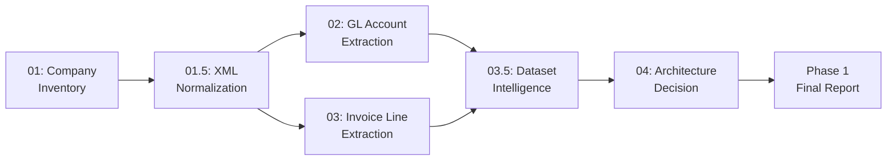
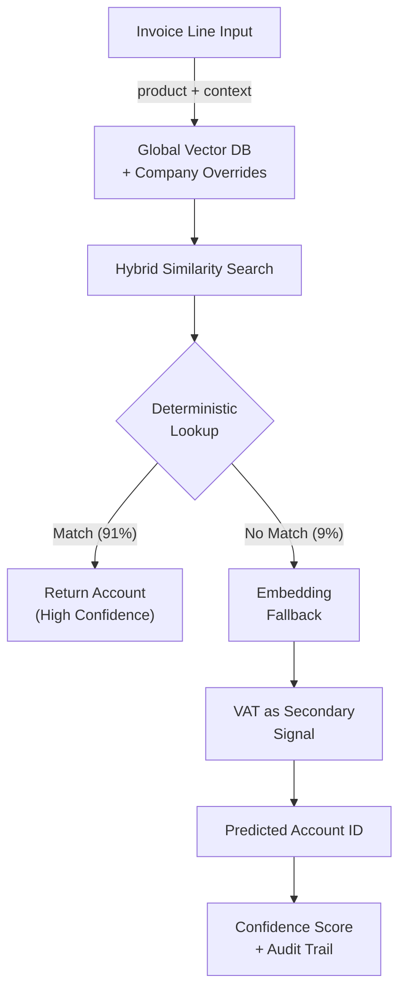

# D406 Invoice Classification — Phase 1 Final Report

> **Status:** Phase 1 Complete  
> **Date:** 2026-06-29  
> **Objective:** Analyze D406 fiscal invoice data, quantify classification difficulty, and recommend a Phase 2 AI architecture  

---

## Executive Summary

Phase 1 analyzed **296,648 invoice lines** across **169 Romanian companies** to determine whether AI-driven account classification is feasible and which architecture to use.

**Key finding:** The dataset has a weighted Accounting Determinism Score (ADS) of **0.847** — meaning the *average* invoice line maps to its dominant account ~85% of the time. However, **91.2% of unique products** are individually deterministic (>0.95 ADS), and only **1.1% are truly ambiguous** (<0.50 ADS). The difficulty is concentrated in a small tail of high-volume, multi-account products that drag the weighted average down.

**Recommended architecture:** A **HYBRID retrieval** system with **RULES_FIRST** model complexity — deterministic lookup handles 91% of products, embedding-based similarity search handles the ambiguous tail, and company-specific overrides accommodate the 69.5% cross-company consistency gap.

| Decision | Outcome | Confidence |
|----------|---------|------------|
| Retrieval Strategy | **HYBRID** (global + company overrides) | MEDIUM |
| Model Complexity | **RULES_FIRST** (lookup + embedding fallback) | HIGH |
| VAT Strategy | **SECONDARY_FEATURE** | MEDIUM |
| Warehouse | **DROP** (100% missing) | HIGH |

---

## 1. Dataset Overview

### Source

Romanian D406 fiscal declarations (SAF-T XML format) from a diverse set of companies spanning retail, services, manufacturing, and distribution.

### Scale

| Metric | Value |
|--------|-------|
| Companies in inventory | 201 |
| Companies with invoices | 169 |
| XML files processed | 1,020 |
| Total invoices | 107,736 |
| — Purchase invoices | 79,616 (73.9%) |
| — Sales invoices | 28,127 (26.1%) |
| Total invoice lines | 296,648 |
| Unique products | 62,447 (raw) / 47,306 (normalized) |
| Unique account IDs (invoices) | 579 |
| Unique account IDs (GL) | 15,168 |
| GL account records | 154,068 |
| Unique VAT rates | 6 |
| Unique tax codes | 55 |

### Company Size Distribution

| Metric | Invoices/Company | Products/Company | Accounts/Company |
|--------|-----------------|-------------------|-------------------|
| Min | 1 | 1 | 1 |
| Median | 68 | — | — |
| Avg | 622.7 | 454.7 | 16.4 |
| Max | 36,685 | 24,207 | 376 |

> [!NOTE]
> The distribution is highly skewed — the median company has 68 invoices, but the average is 623. A few large companies dominate the dataset volume.

### VAT Rate Distribution

| Rate | Line Count | Share |
|------|-----------|-------|
| 21.00% | 167,659 | 56.5% |
| 11.00% | 80,299 | 27.1% |
| 0.00% | 29,675 | 10.0% |
| 19.00% | 5,577 | 1.9% |
| 9.00% | 1,429 | 0.5% |

### Transaction Direction

| Direction | Lines | Share |
|-----------|-------|-------|
| PURCHASE | 218,680 | 73.7% |
| SALE | 77,968 | 26.3% |

### Top Products by Volume

| Product | Lines |
|---------|-------|
| intrare cota b | 14,887 |
| intrare cota a | 9,409 |
| bauturi calde | 6,779 |
| motorina | 4,865 |
| garantie sgr | 3,528 |
| servicii contabilitate | 2,119 |
| discount | 1,976 |
| transport | 1,948 |
| servicii curierat | 1,349 |
| garantie returo sgr pet | 1,077 |

---

## 2. Pipeline Overview

Phase 1 consists of 6 scripts executed sequentially, each building on the outputs of the previous:



| Script | Purpose | Key Output | Rows/Files |
|--------|---------|------------|------------|
| `01_build_inventory.py` | Parse dataset manifest, build company inventory | `companies_inventory.csv` | 201 companies |
| `01_5_xml_normalization.py` | Download, extract, validate XML | `data/normalized/*.xml` | 1,020 files |
| `02_gl_account_extraction.py` | Extract GL chart of accounts | `company_gl_accounts.csv` | 154,068 records |
| `03_invoice_line_extraction.py` | Extract & normalize invoice lines | `invoice_lines_all_companies.csv` | 296,648 lines |
| `03_5_dataset_intelligence.py` | Compute ADS, consistency, quality metrics | 7 intelligence CSVs | ~160K+ data points |
| `04_architecture_decision.py` | Interpret metrics into architecture decisions | `architecture_decision.md` | 5 decisions |

### Pre-Run Validation

Every script has a corresponding `prerun_check.py` step that validates inputs, schemas, dependencies, and output directories before execution. This ensures first-run success and eliminates debugging cycles.

---

## 3. Inventory Results (Script 01)

**201 companies** cataloged from the D406 dataset manifest.

Each company record includes: CUI (fiscal ID), company name, CAEN code (industry classification), and references to their XML declaration files.

The inventory serves as the master registry that all downstream scripts reference for company-level joins and reporting.

---

## 4. XML Normalization (Script 01.5)

| Metric | Value |
|--------|-------|
| XML files downloaded & extracted | 1,020 |
| Failed XMLs | 0 |
| Validation pass rate | 100% |

All 1,020 XML files were successfully downloaded, extracted from ZIP archives where applicable, and validated against the D406 SAF-T schema. The normalized files in `data/normalized/` are the canonical input for all downstream parsers.

---

## 5. GL Account Analysis (Script 02)

| Metric | Value |
|--------|-------|
| Total GL account records | 154,068 |
| Unique account IDs | 15,168 |
| Companies with GL data | 201 |
| Avg accounts per company | 766.5 |
| Min accounts | 2 |
| Max accounts | 14,806 |

> [!NOTE]
> The GL extraction covers all 201 companies (vs. 169 with invoices). The 15,168 unique account IDs across the GL is far larger than the 579 unique accounts actually used in invoice lines — most GL accounts are unused in invoice classification and can be ignored in Phase 2.

---

## 6. Invoice Analysis (Script 03)

| Metric | Value |
|--------|-------|
| Total invoice lines extracted | 296,648 |
| Unique raw products | 62,447 |
| Unique normalized products | 47,306 |
| Companies with invoices | 169 |
| Extraction errors | 12,007 |

### Output Schema

```
cui, company_name, invoice_number, invoice_date, direction,
normalized_product, original_product, account_id, vat_percent,
tax_code, warehouse_id, line_amount, validation_status
```

### Data Quality Summary

| Field | Missing % | Notes |
|-------|-----------|-------|
| product_description | 0.0% | — |
| account_id | 0.0% | — |
| vat_percent | 4.05% | 12,007 lines |
| tax_code | 0.0% | — |
| warehouse_id | **100.0%** | Not present in any record |
| line_amount | **100.0%** | Not present in any record |
| invoice_date | 0.0% | — |
| validation_status | 4.05% | INCOMPLETE status count |
| duplicate_invoice_lines | 5.4% | 16,021 exact duplicates |

> [!IMPORTANT]
> **Warehouse and line amount fields are entirely absent** from the D406 XML schema as implemented. These fields cannot be used as features in Phase 2.
> 
> **4.05% of lines** (12,007) have missing VAT data, corresponding to the extraction error count. These are marked with `INCOMPLETE` validation status.

### Product-to-Account Mapping

The product account mapping table contains **76,843 unique (company, product, account)** tuples, representing the ground truth for how each company classifies each product.

---

## 7. Dataset Intelligence (Script 03.5)

### Accounting Determinism Score (ADS)

The ADS measures how consistently a product maps to a single account. A score of 1.0 means the product always maps to the same account; 0.0 means it's uniformly distributed across many accounts.

| Metric | Value |
|--------|-------|
| **Weighted ADS** | **0.847** |
| **Unweighted ADS** | **0.964** |
| Products with determinism > 0.95 | 43,156 (91.2%) |
| Products with determinism 0.50–0.95 | 3,624 (7.7%) |
| Products with determinism < 0.50 | 526 (1.1%) |

> [!WARNING]
> **ADS Divergence:** The weighted ADS (0.847) is significantly lower than the unweighted ADS (0.964), a gap of 0.117. This means high-volume products (which have more weight) tend to be *less* deterministic. The hardest products are also the most common — this is the core challenge for Phase 2.

### Company Consistency

**168 companies** analyzed for internal classification consistency.

**Most consistent (Top 5):** *(company names anonymized for public docs; counts/percentages are real)*

| Company | Products | Consistent % | Avg Determinism |
|---------|----------|--------------|-----------------|
| LUMENVEST SRL | — | 100.0% | 1.000 |
| CARPATINA SRL | — | 100.0% | 1.000 |
| VITALCORP SRL | — | 100.0% | 1.000 |
| AGROVIN SUD SRL | 299 | 98.7% | 0.993 |
| BINEMED S.R.L. | 39 | 97.4% | 0.984 |

**Least consistent (Bottom 5):**

| Company | Products | Consistent % | Avg Determinism |
|---------|----------|--------------|-----------------|
| CORELINE AXF SRL | 184 | 68.5% | 0.847 |
| AGROTECH PRIM S.R.L. | 25 | 64.0% | 0.800 |
| DULCE STAR S.R.L. | 59 | 62.7% | 0.620 |
| ELEGANTA 2010 SRL | 5 | 60.0% | 0.760 |
| CODEBRIDGE LAB S.R.L. | 2 | 50.0% | 0.950 |

### Cross-Company Consistency

| Metric | Value |
|--------|-------|
| Multi-company products analyzed | 2,696 |
| **Cross-company consistency score** | **0.695** |

Products that are classified consistently *within* companies often diverge *between* companies. The 0.695 cross-company score (vs. the 0.847 within-company ADS) confirms that different companies have different accounting philosophies for the same products.

**Most divergent products across companies:**

| Product | Companies | Global Accounts | Cross-Co Determinism |
|---------|-----------|-----------------|---------------------|
| avans | 29 | 53 | 0.099 |
| storno avans | 13 | 43 | 0.164 |
| pet sgr | 9 | 11 | 0.182 |
| ad blue | 7 | 7 | 0.214 |
| doza sgr | 8 | 8 | 0.265 |
| garantie plastic | 12 | 13 | 0.282 |
| ambalaj sgr | 9 | 11 | 0.280 |

### VAT Stability

| Metric | Value |
|--------|-------|
| Products with single VAT rate | 94.5% |
| Products with 2+ VAT rates | 5.5% |

VAT is a reasonably stable signal (94.5% of products always use the same VAT rate), but falls just short of the 95% threshold needed to use it as a primary discriminator.

---

## 8. Architecture Decision (Script 04)

Script 04 applied 5 threshold-based decision rules to the intelligence metrics. All thresholds are named constants — not magic numbers — and the full decision matrix is recorded for auditability.

### Decision Matrix

| Rule | Metric | Actual Value | Threshold | Decision |
|------|--------|-------------|-----------|----------|
| R1 | Dataset ADS | 0.847 | >= 0.90 (global) / >= 0.75 (hybrid) | **HYBRID** |
| R1 | Cross-company consistency | 0.695 | >= 0.85 | **HYBRID** |
| R3 | Deterministic product % | 91.2% | >= 90% | **RULES_FIRST** |
| R4 | VAT single-rate % | 94.5% | >= 95% (discriminator) / >= 70% (secondary) | **SECONDARY_FEATURE** |
| R5 | Warehouse missing % | 100% | >= 90% | **DROP** |

### Feature Selection

| Feature | Missing % | AI Value | Action |
|---------|-----------|----------|--------|
| product_description | 0.0% | HIGH | INCLUDE_REQUIRED |
| vat_percent | 4.05% | HIGH | INCLUDE_REQUIRED |
| tax_code | 0.0% | HIGH | INCLUDE_REQUIRED |
| direction | 0.0% | HIGH | INCLUDE_REQUIRED |
| warehouse_id | 100.0% | DROP | EXCLUDE |

---

## 9. Final Phase 2 Design



### Architecture Summary

1. **Input Processing:** Normalize the product description (already done in Phase 1 pipeline). Extract context features: `vat_percent`, `tax_code`, `direction`, `company_id`.

2. **Knowledge Base:** Build a **hybrid vector database** — a global knowledge base of product-to-account mappings from all companies, with company-specific override layers for the 31% of cross-company divergent cases.

3. **Classification Pipeline:**
   - **Step 1 — Deterministic Lookup:** For the 91.2% of products that are deterministic (>0.95 ADS), use direct lookup against the knowledge base. This handles the vast majority with no ML needed.
   - **Step 2 — Embedding Fallback:** For ambiguous products, use embedding-based similarity search against the knowledge base. Rank candidates by cosine similarity.
   - **Step 3 — VAT Re-ranking:** Use VAT rate as a secondary signal to break ties between candidate accounts (94.5% of products have stable VAT).

4. **Output:** Predicted account ID with confidence score and an audit trail showing which step produced the prediction and what evidence was used.

### Why Not Global-Only?

The cross-company consistency is only 69.5% — a global-only model would misclassify ~30% of products that different companies book differently. The hybrid approach preserves company-specific accounting logic while sharing knowledge across companies for common products.

### Why Not LLM-First?

91.2% of products are deterministic — using an LLM for every prediction would be wasteful. The RULES_FIRST approach handles the easy 91% with a simple lookup, and only escalates the hard 9% to a more expensive similarity search. LLM reasoning could be added as a third tier if the embedding approach doesn't achieve sufficient accuracy on the ambiguous tail.

---

## 10. Risks & Future Work

### Risks

| Risk | Severity | Mitigation |
|------|----------|------------|
| ADS skewed by high-volume products | MEDIUM | Report both weighted/unweighted ADS; monitor per-product accuracy |
| Cross-company divergence (30.5%) | HIGH | Company-specific overrides in the hybrid model |
| 4.05% missing VAT data | LOW | Use fallback path when VAT is absent |
| Decision thresholds are starting points | LOW | All thresholds are named constants; decision matrix is auditable |
| 5.4% duplicate invoice lines | LOW | Already flagged in data quality report; deduplicate before training |
| Warehouse & line_amount entirely missing | — | Already dropped; no action needed |

### Known Limitations

- **No monetary amounts:** The D406 XML does not include line-level amounts in a way the parser can extract. Classification must rely on product description and categorical features alone.
- **Romanian language only:** All product descriptions are in Romanian. Phase 2 embeddings must use a multilingual or Romanian-specific model.
- **No temporal split tested:** We haven't validated whether classification patterns are stable over time. Phase 2 should include a temporal train/test split.

### Recommended Phase 2 Work

1. **Build the knowledge base** — Convert the product_account_mapping into embeddings, stored in a vector database with company-level partitioning.
2. **Implement the classification pipeline** — Deterministic lookup, then embedding fallback, then VAT re-ranking.
3. **Evaluate accuracy** — Measure per-company and per-product accuracy on a held-out test set, with particular attention to the 526 ambiguous products.
4. **Handle edge cases** — Products that span multiple accounts may need a "top-K with confidence" output rather than a single prediction.
5. **Build feedback loop** — Allow accountants to correct predictions, feeding corrections back into the knowledge base.

---

## Appendix A: File Inventory

### Pipeline Scripts

| Script | Size | Purpose |
|--------|------|---------|
| `01_build_inventory.py` | 7.2 KB | Company inventory from dataset manifest |
| `01_5_xml_normalization.py` | 15.0 KB | XML download, extraction, validation |
| `02_gl_account_extraction.py` | 9.3 KB | GL chart of accounts extraction |
| `03_invoice_line_extraction.py` | 17.1 KB | Invoice line extraction & normalization |
| `03_5_dataset_intelligence.py` | 18.2 KB | ADS, consistency, quality metrics |
| `04_architecture_decision.py` | ~16 KB | Architecture decision engine |

### Intelligence Outputs

| File | Size | Content |
|------|------|---------|
| `product_ambiguity.csv` | 2.9 MB | 47,306 products with ADS scores |
| `vat_consistency.csv` | 3.4 MB | 61,174 product VAT stability records |
| `cross_company_consistency.csv` | 110 KB | 2,696 multi-company product analyses |
| `company_consistency.csv` | 7.7 KB | 168 company consistency scores |
| `dataset_statistics.csv` | 0.9 KB | 28 descriptive statistics |
| `ai_readiness.csv` | 0.4 KB | 5 feature AI-value ratings |
| `data_quality_report.csv` | 0.4 KB | 9 field quality assessments |
| `decision_matrix.csv` | ~1 KB | 11 decision rule evaluations |
| `feature_selection.csv` | ~0.4 KB | 5 feature action decisions |

### Reports

| File | Purpose |
|------|---------|
| `reports/architecture_decision.md` | Full architecture recommendation with evidence |
| `reports/phase1_final_report.md` | This document |

---

*Phase 1 complete. This report is the handoff from Data Engineering to AI Engineering.*
